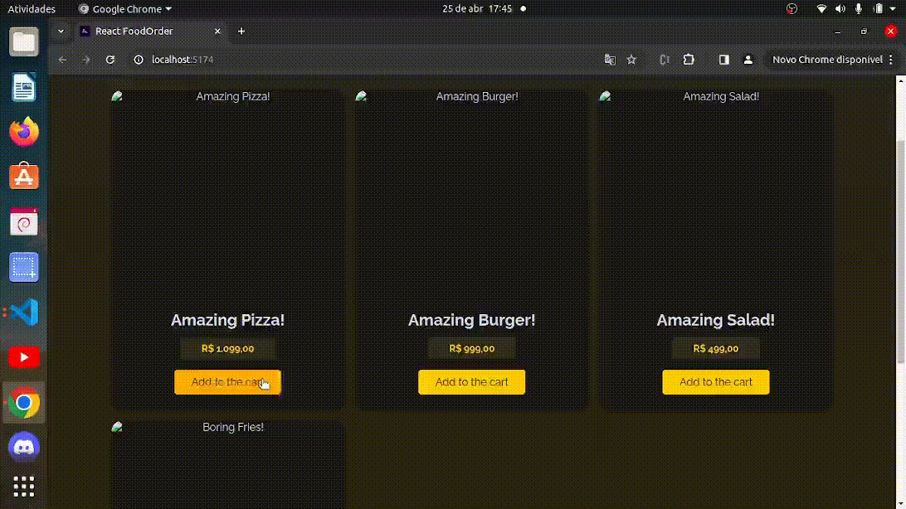

## 🎥 Video of my Thought process

Thought process: [Link](https://youtu.be/cehnIllbMSQ)

## 🚀 Installation and Execution

To install and run the project locally, follow these steps:

1. **Clone the repository**:

```bash
git clone https://github.com/thiagoassisk8/spring-boot-grocery
```

2. **Install the dependencies**:

```bash
nvm install
```

3. **Navigate to the project directories**:

```bash
cd spring-boot-grocery
```

4. **Install frontend dependencies and start the frontend server**:

```bash
cd bonus-frontend/
npm install
npm start
```

5. **Start the WireMock server**:

```bash
cd wiremock/
./start.sh
```

6. **Compile and run the Spring Boot application**:

```bash
javac SpringBootGroceryApplication.java
java SpringBootGroceryApplication
```

These commands will compile and run the Spring Boot application locally. Ensure you have Java installed and properly configured on your system.

7. **Access the Application**:

   Open your browser and go to [http://localhost:5173](http://localhost:5173). This will launch the development server and load the application automatically.


**Image**


## Business Logic Explanation

The application's business logic ensures a comprehensive solution meeting requirements:

1. Utilizing WireMock, the application seamlessly integrates data retrieval for the payment system, ensuring smooth usability.
2. The payment system intelligently applies discounts based on specified parameters, ensuring customers benefit from available deals. Cupoms are only applied if the requirements match, ensuring fairness and consistency.
3. Enhancing customer experience, the system displays the amount saved through applied discounts.

The entire business logic relies on the `/products/addCart` endpoint because it follows these key rules required:

1. Items can be added in any order.
2. Discounts should be used whenever they're applicable.
3. The store owner wants to show how much money the customer is saving.
