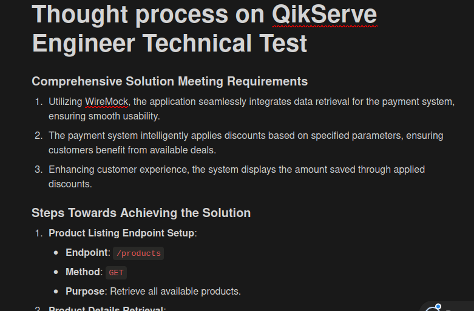

**API DOCUMENTATION**
Api Documentation: [Link](https://immense-thicket-69297-ae6d8599f1bc.herokuapp.com/api-docs/)
Thought process: [Link](https://almond-pint-9bd.notion.site/Thought-Process-on-QuikServe-Challenge-c8953c1e907f4986abc5ff92b71115bf)


1. **How long did you spend on the test? What would you add if you had more time?**
   I spent about 9 hours over the course of 3 days on the test. If I had more time, I would have added more unit tests using Mockito, for instance, to ensure there were no breaches. I believe that the more tests you implement in the application, the better it becomes, as it allows us to more effectively detect breaches that may not have been previously identified.
2. **What was the most useful feature that was added to the latest version of your chosen language? Please include a snippet of code that shows how you've used it?**

If we are discussing my usage, the snippet underneeth would be appropriate, as whenever I found myself in a tight spot needing info from WireMock, it came to the rescue. It was like having a handy tool in my toolbox, making data retrieval easy.
However, if we were considering general use for more people who would work on the same project, I would say that the [documentation](https://immense-thicket-69297-ae6d8599f1bc.herokuapp.com/api-docs/) becuase would be make it easier to peopole get know the api.

```java
    public Product fetchProductById(String productId) throws IOException {
        String url = getEndpoint() + "/products/" + productId;
        Request request = new Request.Builder()
                .url(url)
                .get()
                .build();

        try (Response response = client.newCall(request).execute()) {

            if (!response.isSuccessful()) {
                String errorMessage = String.format("There's no product with ID %s: %s", productId, response);
                throw new IOException(errorMessage);
            }

            return parseResponse(response, Product.class);
        }
    }

    private <T> T parseResponse(Response response, Type type) throws IOException {
        return gson.fromJson(response.body().string(), type);
    }
```

3. **What did you find most difficult?**

   The most challenging aspect was thinking about a solution that effectively addressed all the system's requirements and turning it into code. Given the object-oriented nature of the codebase, it was crucial to have a clear understanding of the solution before diving into implementation. Specifically, I struggled with handling the functionality of discounting within a tight timeframe.

4. **What mechanism did you put in place to track down issues in production on this code? If you didn’t put anything, write down what you could do.**

   I set up a couple of ways to track down problems when I was coding. First off, I did a lot of debugging to really dive deep into the data and find any issues. And then, I made sure to use the spring-boot-devtools package so I could do maintenance on the server in real-time. That way, I could quickly jump in and fix anything that came up.

5. **The Wiremock represents one source of information. We should be prepared to integrate with more sources. List the steps that we would need to take to add more sources of items with diferent formats and promotions.**

**Step 1**
Add a new type of Cupom (src/main/java/com/qikserver/grocery/entities/CupomType.java)
given that diferent type of promotions would come in

**Step 2**
Given this information it seems prudent to introduce a new CupomController to improve the project's adaptability to future requirements. further more, it's advisable to implement a CupomService class (src/main/java/com/qikserver/grocery/services/CupomService.java) to streamline the management of cupom-related operations. These additions will not only improve the project's scalability but also facilitate the integration of forthcoming functionalities.

**Describe the most innovative or inventive endeavor you've undertaken. This could be your idea for a process change, a new product concept, a unique metric, or a novel customer interface. Do not share confidentail information! Provide context to help us understand the innovation. What problem were you addressing, and what were the outcomes? Why was solving this problem important, and what was the impact of the change?**
So a company I worked for developed an app similar to iFood, but for home renovation services. Initially the app only worked on mobile devices and used the user's location to connect clients with nearby service providers.

Later when they expanded the app to a web version, real estate agencies started requesting services for their clients, but faced an issue: they couldn't provide the precise location of the clients (hosts).

To solve this my thogught was to create a form where real estate agencies input the host' addresses. Then, this address is converted into geolocation, allowing the service to be provided effectively, even without the exact location of the clients.

Additionally, to implement this solution, I had to research which resources could assist in this process. That's when I found out about the Google Cloud Platform (GCP), which offers tools to handle geolocation and convert addresses into geographic coordinates. This discovery enabled the creation of the form that exchanges data for geolocation, providing an effective solution for real estate agencies to request services for hosts.

Solving this problem was important for Real estate agencies due to the fact they faced a significant hurdle in requesting services for their clients becuase the inability to provide precise location data. The solution of creating a form to input addresses and converting them into geolocations streamlined the process, boosting the user experience for both the agencies and the service providers.


